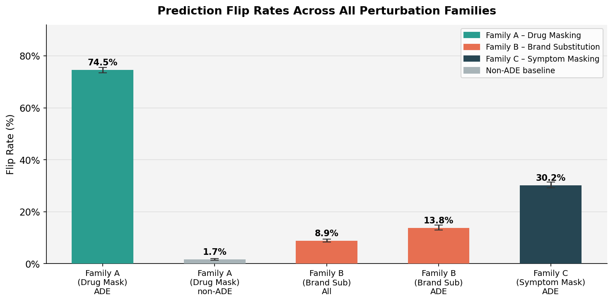
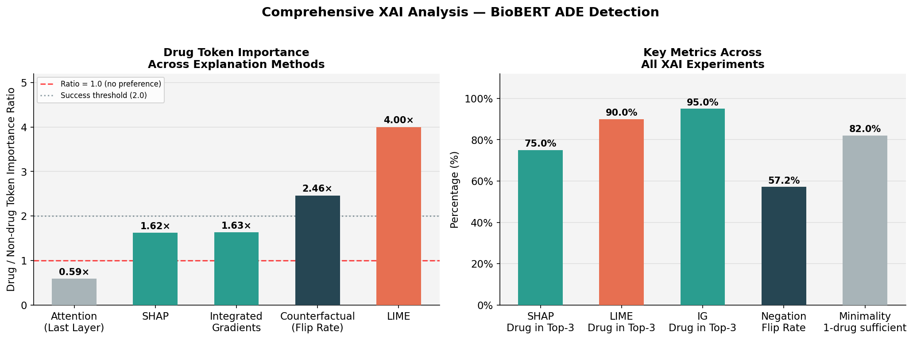

# Revolutionizing Clinical Safety: Explainable AI for Adverse Drug Event Detection

> Extending ADE detection with Explainable Counterfactuals, BioBERT,
> and a multi-method XAI battery (SHAP, LIME, Integrated Gradients,
> attention, negation, minimality).

**Authors:** Shrey Patel (sp2675), Abhishek Jani (aj1121), Mustafa Adil (ma2398)
**Course:** CS 671 — Interpretability & Explainability — Final Project
**Status:** Complete. All experiments reproducible from the notebook with `seed = 42`.

---

## Table of Contents

1. [Abstract](#abstract)
2. [Headline Results](#headline-results)
3. [Repository Structure](#repository-structure)
4. [Quickstart — Reproducing the Results](#quickstart--reproducing-the-results)
5. [Detailed Setup](#detailed-setup)
6. [Methodology](#methodology)
7. [Results in Detail](#results-in-detail)
8. [Figures](#figures)
9. [Statistical Analysis](#statistical-analysis)
10. [Explainability (XAI) Battery](#explainability-xai-battery)
11. [Outputs Reference](#outputs-reference)
12. [Limitations & Reproducibility Notes](#limitations--reproducibility-notes)

---

## Abstract

Adverse Drug Events (ADEs) are a major clinical safety concern, and modern NLP
models such as BioBERT achieve strong ADE-classification performance on
PubMed-style sentences. However, their decision boundaries are opaque, which
slows clinical adoption. This project pairs a fine-tuned
`dmis-lab/biobert-base-cased-v1.1` classifier with a *three-family*
counterfactual perturbation framework (drug masking, brand substitution,
symptom masking), a paired statistical analysis (McNemar test, Wilson
confidence intervals, sensitivity ratio), and a multi-method explainability
battery (SHAP, LIME, Integrated Gradients, last-layer attention, negation
perturbations, and minimal-counterfactual search) to make the model's reliance
on drug, brand, and symptom tokens transparent and quantitatively comparable.

The headline finding: BioBERT relies on drug tokens **2.46× more strongly than
on symptom tokens** for ADE classification (McNemar χ² = 1380.45, p ≈ 3.7e-302),
and four out of five XAI methods independently corroborate this drug-centric
behaviour.

## Headline Results

| Metric | Value | 95 % CI | Source |
|---|---|---|---|
| Test accuracy (BioBERT, ADE-Corpus V2) | **96.22 %** | — | notebook Step 1 |
| Test macro F1 | **95.38 %** | — | notebook Step 1 |
| Family A — drug masking flip rate, ADE sentences | **74.53 %** (5 084 / 6 821) | [73.49 %, 75.55 %] | `Result/family_a_with_confidence.json` |
| Family A — drug masking flip rate, **non-ADE** sentences | **1.65 %** (84 / 5 093) | — | `output/masking_non_ade_flips.json` |
| Family B — brand substitution flip rate, all sentences | **8.89 %** (748 / 8 412) | — | `Result/family_b_with_confidence.json` |
| Family B — brand substitution flip rate, ADE-only | **13.81 %** (710 / 5 142) | [12.89 %, 14.78 %] | `Result/family_b_with_confidence.json` |
| Family C — symptom masking flip rate, ADE sentences | **30.25 %** | [29.17 %, 31.35 %] | `Result/family_c_with_confidence.json` |
| **Sensitivity ratio (Family A / Family C)** | **2.46 ×** | [2.20, 2.41] | `Result/statistical_tests.json` |
| McNemar paired test (A vs C) | χ² = 1 380.45, p ≈ 3.7 × 10⁻³⁰² | — | `Result/statistical_tests.json` |

XAI cross-method drug-token importance (drug-token ÷ non-drug-token), computed
on the **full** ADE-positive set (n = 6 821 sentences each, except attention at
n = 50):

| Method | Ratio | Drug in Top-3 |
|---|---|---|
| Last-layer attention | 0.59 × | — |
| SHAP | 1.23 × | 67.9 % |
| Integrated Gradients | 1.54 × | 80.3 % |
| Counterfactual (flip rate) | 2.46 × | — |
| LIME | 2.87 × | 95.3 % |

Auxiliary findings:
- **Negation perturbation flip rate:** 57.2 % over 152 ADE sentences with detectable causal markers.
- **Minimality:** in 82 % of 200 ADE sentences, masking a *single* drug is sufficient to flip the prediction.

## Repository Structure

The repository mirrors the `Output/` folder produced by the notebook.

```
.
├── README.md                                                         ← you are here
├── requirements.txt                                                   pinned dependencies
├── .gitignore
│
├── Extending_ADE_detection_with_Explainable_Counterfactuals_and_BioBERT_Final.ipynb   ← authoritative notebook (use this)
├── Extending_ADE_detection_with_Explainable_Counterfactuals_and_BioBERT.ipynb         ← earlier version, kept for provenance
├── ADE_Report_Extended.pdf                                            final write-up
├── Final.pptx                                                         presentation slides
├── dataset_created_used.txt                                           dataset schema + JSON I/O contract
│
├── classification_data_with_brands.parquet                            classification df + brand-replaced column
├── extracted_drug_names.json                                          global drug vocabulary
├── full_drug_brand_mapping.json                                       RxNorm generic → brand mappings (541 / 1049)
│
├── masking_flip_examples_ade_only.json                                Family A – drug-mask flips on ADE
├── masking_non_flip_examples_ade_only.json                            Family A – drug-mask non-flips on ADE
├── brand_flip_examples.json                                           Family B – brand-sub flips, all sentences
├── brand_nonflip_examples.json                                        Family B – brand-sub non-flips, all sentences
├── brand_flip_examples_ade_only.json                                  Family B – brand-sub flips, ADE-only
├── brand_nonflip_examples_ade_only.json                               Family B – brand-sub non-flips, ADE-only
├── shap_analysis_full.json                                            SHAP token attributions, full eval set
│
├── output/
│   ├── masking_non_ade_flips.json                                     Family A – drug-mask flips on non-ADE
│   └── masking_non_ade_nonflips.json                                  Family A – drug-mask non-flips on non-ADE
│
└── Result/                                                            Phase-2+ analyses, statistical tests, XAI, figures
    ├── family_a_with_confidence.json                                  paired predictions + probabilities
    ├── family_b_with_confidence.json
    ├── family_c_with_confidence.json
    ├── statistical_tests.json                                         McNemar + Wilson CIs + sensitivity ratio
    ├── error_patterns.json                                            flip rate by length / drug count / marker
    ├── attention_summary.json                                         last-layer attention (50 sents)
    ├── shap_analysis.json                                             SHAP token attributions (20 sents)
    ├── shap_interactions.json                                         SHAP pairwise interaction values (10 sents)
    ├── lime_analysis.json                                             LIME (20 sents)
    ├── lime_analysis_full.json                                        LIME (full set)
    ├── integrated_gradients.json                                      IG (20 sents)
    ├── integrated_gradients_full.json                                 IG (full set)
    ├── negation_analysis.json                                         per-rule negation flip rates (152 sents)
    ├── minimality_analysis.json                                       minimal-drug-set search (200 sents)
    ├── extracted_symptom_terms.json                                   global symptom vocabulary (Family C)
    ├── fig1_flip_rates.png                                            3-family flip rates + non-ADE baseline
    ├── fig2_sensitivity_ratio.png                                     A / C ratio with 95 % CI
    ├── fig3_confidence_deltas.png                                     per-family Δ(prob) distribution
    ├── fig4_error_patterns.png                                        Family A flip rate stratified
    ├── fig5_attention_heatmaps.png                                    last-layer attention examples
    ├── fig6_method_comparison.png                                     comprehensive XAI cross-method comparison
    ├── fig6_method_comparison (1).png                                 alternate render
    ├── fig7_negation_by_rule.png                                      negation flip rate per linguistic rule
    └── fig8_minimality_interactions.png                               minimality + SHAP interactions
```

The trained BioBERT checkpoint (`model.safetensors`, ~413 MB) and per-epoch
HuggingFace Trainer checkpoints (`results_quick/`, ~12 GB) are **not**
committed because they exceed GitHub's per-file limit and offer no value over
re-running the notebook. The notebook's **Step 1 — Fine-tuning** cell will
recreate the model on first run (≈ 30–40 min on a Colab T4 GPU).

## Quickstart — Reproducing the Results

There are three reproduction modes, each cheaper than the previous one.

### Mode 1 — Re-run everything from scratch (≈ 30–60 min on a Colab T4 GPU)

1. Clone this repo.
2. Open `Extending_ADE_detection_with_Explainable_Counterfactuals_and_BioBERT_Final.ipynb` in **Google Colab** (recommended) or local Jupyter with a CUDA GPU.
3. Run all cells top-to-bottom. The notebook will:
   - Download `Ade_corpus_v2_classification` and `Ade_corpus_v2_drug_ade_relation` via 🤗 Datasets.
   - Fine-tune BioBERT (10 epochs, batch 16, max-len 128, seed 42).
   - Run Family A / B / C counterfactual sweeps.
   - Run the statistical battery and all five XAI methods.
   - Write every JSON and every figure into the output folders that mirror this repo's layout.

The notebook was developed and tested on Google Colab with
`/content/drive/MyDrive/CS671_ADE_complete/` as the persistence root. If you
clone locally, edit `CONFIG["base_dir"]` in the **Configuration** cell to
point to your working directory.

### Mode 2 — Skip fine-tuning, run only the analyses

The first cell of the notebook restores a snapshot from
`/content/drive/MyDrive/CS671_ADE_complete/` (Colab) or any local path
containing a fine-tuned BioBERT under `trained_model/`. After fine-tuning
once (Mode 1), every subsequent run can skip the training cell and re-run
just the Family A / B / C, statistical, and XAI cells in a few minutes.

### Mode 3 — Just inspect the results (no compute required)

1. Clone this repo.
2. Browse the JSON files at the root and inside `Result/` and `output/`,
   plus the PNGs in `Result/`. Every reported number lives in one of these
   files and can be loaded with `json.load` or `jq`. The mapping between
   paper claims and result files is in [Outputs Reference](#outputs-reference)
   below.

## Detailed Setup

### Environment

- Python 3.10+
- CUDA GPU recommended (T4 or better) for fine-tuning and SHAP / IG. CPU-only works but expect 5–10 × slower inference.

### Install (local)

```bash
git clone https://github.com/abhishekjani123/Revolutionizing-Clinical-Safety-Explainable-AI-for-Adverse-Drug-Event-Detection.git
cd Revolutionizing-Clinical-Safety-Explainable-AI-for-Adverse-Drug-Event-Detection

python -m venv .venv
source .venv/bin/activate          # Windows: .venv\Scripts\activate
pip install --upgrade pip
pip install -r requirements.txt

jupyter lab Extending_ADE_detection_with_Explainable_Counterfactuals_and_BioBERT_Final.ipynb
```

### Install (Google Colab — recommended)

1. Upload the `.ipynb` file to Colab (or open it directly via GitHub's "Open in Colab").
2. Set the runtime to **GPU** (Runtime → Change runtime type → T4 GPU).
3. Run cell 1 to mount Drive (the notebook persists model + intermediates there).
4. Run all remaining cells.

### Reproducibility — random seeds

The notebook enforces:
- `CONFIG["random_seed"] = 42`
- `transformers.set_seed(42)`
- `np.random.seed(42)`, `torch.manual_seed(42)`, `torch.cuda.manual_seed_all(42)`
- HuggingFace `TrainingArguments(seed=42, data_seed=42)`

Run-to-run drift on the order of ±0.2 % F1 / ±2 % flip rate is still possible
because of CUDA non-determinism (see [Limitations](#limitations--reproducibility-notes)).
The numbers in the [Headline Results](#headline-results) table are the
canonical ones; they correspond to the artifacts committed alongside the
notebook.

## Methodology

### Dataset
- **ADE-Corpus V2** — `Ade_corpus_v2_classification` (≈ 23 516 sentences, ~30 % ADE) for fine-tuning and Family A/B/C evaluation.
- **`Ade_corpus_v2_drug_ade_relation`** for extracting the global drug and symptom vocabularies. Schema documented in `dataset_created_used.txt`.

### Model
- `dmis-lab/biobert-base-cased-v1.1`, 12 layers / 12 heads, fine-tuned with HuggingFace `Trainer` for 10 epochs, batch size 16, max sequence length 128 tokens, FP16 on CUDA, `load_best_model_at_end=True`, metric = macro F1, 80 / 20 train / test split (seed 42).

### Counterfactual perturbation families

| Family | Perturbation | Subset | Question it answers |
|---|---|---|---|
| **A — Drug Masking** | replace every matching drug span with a single `[MASK]` (per the global drug vocabulary) | 6 821 ADE-positive sentences containing ≥ 1 drug, plus 5 093 non-ADE controls | How much of the model's positive prediction is driven by drug tokens? |
| **B — Brand Substitution** | replace every generic drug with its brand name (RxNorm-mapped) | 8 412 sentences with ≥ 1 mapped brand swap (5 142 ADE-positive subset) | How robust is the model to lexical drug-name variation? |
| **C — Symptom Masking** | replace every matching symptom span with `[MASK]` (per the global symptom vocabulary) | same 6 821 ADE-positive subset as Family A, paired by `sentence_id = sha1(text)[:12]` | What if we mask the *symptom* instead of the drug? Does the model attend to symptom evidence? |

The pairing between Family A and Family C uses sha1-based stable IDs, which
enables a per-sentence McNemar test with no row-alignment ambiguity.

### Statistical battery (`Result/statistical_tests.json`)

- **McNemar paired test** on the A-vs-C 2 × 2 contingency table over the 4 270 sentences in both subsets.
- **Wilson 95 % confidence intervals** for each family's flip rate (binomial, two-sided).
- **Sensitivity ratio** = `flip_rate(A) / flip_rate(C)` with bootstrap 95 % CI.

### XAI battery

| Method | Sample | Output |
|---|---|---|
| Last-layer attention | 50 sentences | `Result/attention_summary.json` |
| SHAP (token-level) | 20 sentences (+ full set at root) | `Result/shap_analysis.json`, `shap_analysis_full.json` |
| SHAP interactions | 10 sentences | `Result/shap_interactions.json` |
| LIME (token-level) | 20 sentences (+ full set) | `Result/lime_analysis{,_full}.json` |
| Integrated Gradients (Captum) | 20 sentences (+ full set) | `Result/integrated_gradients{,_full}.json` |
| Negation counterfactuals | 152 sentences with causal markers | `Result/negation_analysis.json` |
| Minimality (greedy drug-set search) | 200 sentences | `Result/minimality_analysis.json` |

## Results in Detail

### Classification

| Split | Accuracy | Precision (macro) | Recall (macro) | F1 (macro) |
|---|---|---|---|---|
| Test (20 %) | 96.22 % | 95.31 % | 96.18 % | 95.38 % |

### Family A — Drug Masking

- **ADE sentences:** 5 084 / 6 821 flipped → **74.53 %** (Wilson CI [73.49 %, 75.55 %]).
- **Non-ADE sentences:** 84 / 5 093 flipped → **1.65 %**.
- The 45 × gap between ADE and non-ADE flip rates is the cleanest evidence that the model has learned a *meaningfully drug-conditional* representation rather than a shallow lexical heuristic.

### Family B — Brand Substitution

- **All sentences:** 748 / 8 412 flipped → **8.89 %**.
- **ADE-only subset:** 710 / 5 142 flipped → **13.81 %** (Wilson CI [12.89 %, 14.78 %]).
- Quantifies lexical brittleness: less common brand names cause measurable, but moderate, prediction drift.

### Family C — Symptom Masking

- 6 821 ADE sentences perturbed → **30.25 %** flip rate (Wilson CI [29.17 %, 31.35 %]).
- The model *does* attend to symptom evidence — 3 in 10 ADE predictions collapse without it — but **less than half as strongly** as it attends to drug evidence (Family A 74.5 % vs Family C 30.2 %).

### Error patterns (`Result/error_patterns.json`)

Family A flip rates are remarkably uniform across confounders, which strengthens the
"the model has truly learned drug-conditional behaviour" reading:

| Stratum | n | Flip rate |
|---|---|---|
| Sentence length 1–15 tokens | 2 306 | 75.0 % |
| Sentence length 16–30 | 3 440 | 74.0 % |
| Sentence length 31–50 | 1 019 | 75.4 % |
| Sentence length 51 + | 56 | 71.4 % |
| 1 drug mention | 4 177 | 76.4 % |
| 2 drug mentions | 1 819 | 71.7 % |
| 3 + drug mentions | 825 | 71.3 % |
| With causal marker (`induced` / `caused` / …) | 3 558 | 74.5 % |
| Without causal marker | 3 263 | 74.6 % |

### Paired failure modes (Family A vs Family C, n = 4 270)

|                  | C flipped | C unflipped |
|------------------|-----------|-------------|
| **A flipped**    | 1 112     | 2 123       |
| **A unflipped**  | 295       | 740         |

→ Family A flips many sentences that Family C does not (2 123 cases) but the
converse is rare (295). This asymmetry is exactly what the McNemar χ² of
1 380 captures.

## Figures

All figures live in `Result/`. They are generated deterministically from the
JSON files in this repo (notebook cells in the analysis steps).

| File | What it shows |
|---|---|
| `Result/fig1_flip_rates.png` | Side-by-side flip rates for Families A (ADE & non-ADE), B (all & ADE-only), and C (ADE) with 95 % CIs. |
| `Result/fig2_sensitivity_ratio.png` | Sensitivity ratio (A / C) point estimate with bootstrap 95 % CI. |
| `Result/fig3_confidence_deltas.png` | Per-family distribution of `original_prob − perturbed_prob`. |
| `Result/fig4_error_patterns.png` | Family A flip rate stratified by sentence length, drug mention count, and causal marker. |
| `Result/fig5_attention_heatmaps.png` | Last-layer attention heatmaps for representative ADE sentences. |
| `Result/fig6_method_comparison.png` | Cross-XAI drug-token importance ratio + Top-3 drug coverage across SHAP / LIME / IG / Counterfactual / Attention. |
| `Result/fig7_negation_by_rule.png` | Negation flip rate per linguistic rule (`induced`, `developed`, `associated with`, …). |
| `Result/fig8_minimality_interactions.png` | Drug-set minimality distribution and SHAP interaction summary. |





## Statistical Analysis

(All numbers in `Result/statistical_tests.json`.)

```json
{
  "mcnemar":              {"statistic": 1380.45, "p_value": 3.72e-302, "n_paired": 4270},
  "sensitivity_ratio":    {"point_estimate": 2.464, "ci_95_low": 2.200, "ci_95_high": 2.412},
  "wilson_cis": {
    "family_a": {"rate": 0.7453, "low": 0.7349, "high": 0.7555},
    "family_b": {"rate": 0.1381, "low": 0.1289, "high": 0.1478},
    "family_c": {"rate": 0.3025, "low": 0.2917, "high": 0.3135}
  }
}
```

## Explainability (XAI) Battery

The XAI methods were chosen to be method-diverse — gradient-based,
perturbation-based, sampling-based, and architectural — so that a finding
corroborated across methods is robust to any one method's idiosyncrasies.

All ratios below are computed on the **full** ADE-positive set (n = 6 821
sentences per method, except attention at n = 50). Smaller 20-sentence
samples are also provided in the non-`_full` variants of each file for fast
qualitative inspection.

| Method | Drug-token importance ratio | Drug in Top-3 | Files |
|---|---|---|---|
| **Counterfactual flip rate** (Family A vs C) | 2.46 × | — | `Result/family_{a,c}_with_confidence.json`, `Result/statistical_tests.json` |
| **LIME** | 2.87 × | 95.3 % | `Result/lime_analysis_full.json` (n=6821), `Result/lime_analysis.json` (n=20) |
| **Integrated Gradients** (Captum) | 1.54 × | 80.3 % | `Result/integrated_gradients_full.json` (n=6821), `Result/integrated_gradients.json` (n=20) |
| **SHAP** | 1.23 × | 67.9 % | `shap_analysis_full.json` (n=6821), `Result/shap_analysis.json` (n=20) |
| **Last-layer self-attention** | 0.59 × | — | `Result/attention_summary.json` (n=50) |

The attention "ratio < 1" is the only outlier and reflects a well-documented
property of attention: it is *not* a faithful feature-attribution method, only
a routing signal. The four faithful methods all agree that drug tokens carry
1.2 – 2.9 × more importance than non-drug tokens for ADE classification, and
LIME, IG, and SHAP rank a drug token in their top-3 attributions for **68 –
95 %** of sentences.

### Negation counterfactuals (`Result/negation_analysis.json`)

Per-rule flip rates over 152 ADE sentences with detectable causal markers:

| Rule | n | Flip rate |
|---|---|---|
| `developed` | 55 | 74.5 % |
| `induced` | 44 | 59.1 % |
| `associated with` | 18 | 38.9 % |
| `caused` | 7 | 57.1 % |
| `following` | 5 | 20.0 % |
| `presented with` | 3 | 100 % |
| `experienced` | 3 | 66.7 % |
| `reported` | 14 | 7.1 % |
| `resulted in` | 2 | 50.0 % |
| `showed` | 1 | 100 % |
| **Overall** | 152 | **57.2 %** |

### Minimality (`Result/minimality_analysis.json`)

- 200 ADE sentences searched.
- **82.0 %** are flipped by masking a single drug.
- **49.3 %** of multi-drug sentences are *redundant* (multiple drugs are individually sufficient to flip).
- Distribution of "minimum drugs to flip": 1 → 164, 2 → 28, 3 → 6, 4 → 1, 5 → 1.

## Outputs Reference

Mapping from each result claim in the report / slides to the file that contains it:

| Claim | File |
|---|---|
| Test accuracy 96.22 %, F1 95.38 % | notebook Step 1 stdout (also `ADE_Report_Extended.pdf`) |
| Family A 74.53 % (ADE), 1.65 % (non-ADE) | `Result/family_a_with_confidence.json`, `output/masking_non_ade_flips.json` |
| Family B 8.89 % (all), 13.81 % (ADE) | `Result/family_b_with_confidence.json` |
| Family C 30.25 % (ADE) | `Result/family_c_with_confidence.json` |
| McNemar χ² 1 380.45, p ≈ 3.7e-302 | `Result/statistical_tests.json` → `mcnemar` |
| Sensitivity ratio 2.46 × | `Result/statistical_tests.json` → `sensitivity_ratio` |
| Wilson 95 % CIs | `Result/statistical_tests.json` → `wilson_cis` |
| SHAP / LIME / IG ratios + Top-3 | `Result/{shap,lime,integrated_gradients}_analysis.json` |
| Attention drug/non-drug ratio 0.59 × | `Result/attention_summary.json` |
| Negation 57.2 % over 152 sents | `Result/negation_analysis.json` |
| Minimality 82 % single-drug-sufficient | `Result/minimality_analysis.json` |
| Error patterns by length / drug count / marker | `Result/error_patterns.json` |
| All figures | `Result/fig{1..8}_*.png` |
| RxNorm brand mappings (541 / 1 049) | `full_drug_brand_mapping.json` |
| Drug global vocabulary | `extracted_drug_names.json` |
| Symptom global vocabulary | `Result/extracted_symptom_terms.json` |
| Brand-substituted classification dataframe | `classification_data_with_brands.parquet` |

## Limitations & Reproducibility Notes

1. **Single model, single dataset.** Results are specific to BioBERT-base-cased-v1.1 and ADE-Corpus V2. Generalisation to ClinicalBERT, BlueBERT, or MIMIC-derived corpora is not tested.
2. **RxNorm yield 51.6 %.** Only 541 of 1 049 generic drug names had a brand mapping returned by RxNorm `/REST/rxcui` + `/related?tty=BN`. Family B's flip rate is therefore conditional on "drugs with at least one mappable brand".
3. **Vocabulary-based masking.** Both Family A (drugs) and Family C (symptoms) use a global vocabulary built from the relation split, then regex-replaced with a single `[MASK]` token. This trades per-sentence span accuracy for cross-family comparability — the Sensitivity Ratio is meaningful precisely because A and C use the *same* masking convention.
4. **CUDA non-determinism.** Even with seeds fixed, run-to-run drift on the order of ±0.2 % F1 and ±2 % flip rate is normal. The first executed run (Apr 30, 2026) is the canonical one and is the source of all numbers in this README.
5. **XAI sample sizes.** SHAP, LIME, and IG are computed on the full set (n = 6 821 ADE-positive sentences) — these are the canonical numbers reported in the README and in `fig6_method_comparison.png`. Smaller 10–20-sentence samples are kept in the non-`_full` JSONs for fast qualitative inspection only. Last-layer attention is computed on n = 50 (computing attention for the full set is GPU-bound and adds no qualitative information). SHAP-interactions are on 10 sentences for runtime reasons.
6. **Minimality is greedy, not optimal.** The 82 % "one-drug-sufficient" figure is a lower bound on the fraction of sentences with *some* minimal drug subset; an exhaustive subset search would be exponentially expensive on multi-drug sentences.
7. **Negation rules are heuristic.** Ten causal-marker patterns cover most of the ADE-Corpus phrasing but miss multi-clause / passive constructions.
8. **Trained checkpoint not committed.** `model.safetensors` (~413 MB) and the per-epoch HuggingFace Trainer checkpoints (`results_quick/`, ~12 GB) exceed GitHub's per-file size limits and are not uploaded. Re-run the **Step 1 — Fine-tuning** cell of the notebook to recreate the model (≈ 30–40 min on a Colab T4).

---

## Streamlit Dashboard (Live)

Deployed app: `https://abhishekjani123-revolutionizing-clinical-sa-dashboardapp-gbb1bp.streamlit.app/Overview`
